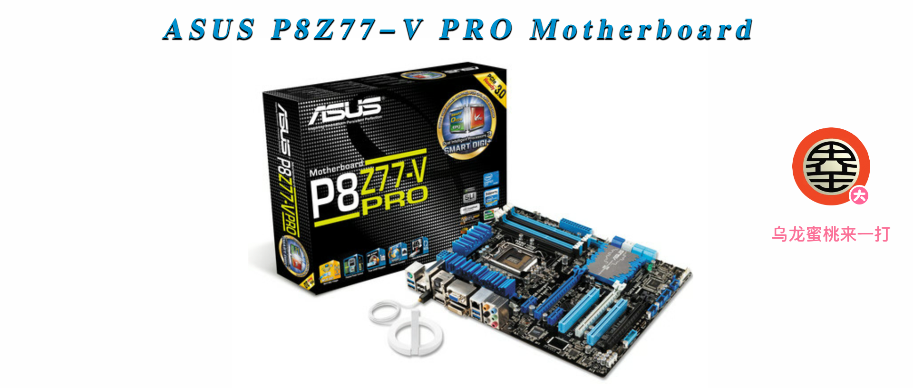
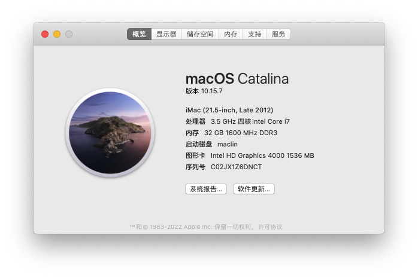
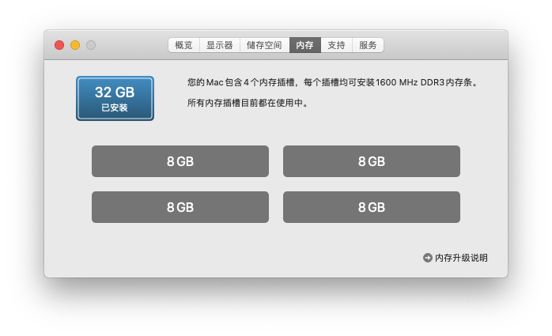
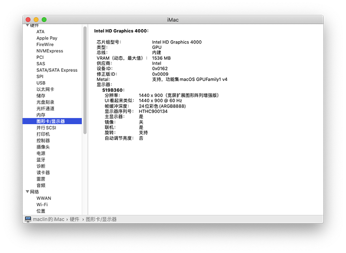
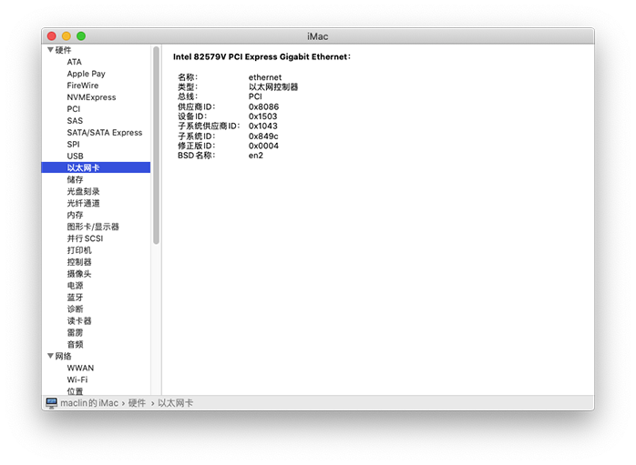

# ASUS-P8Z77-V-PRO 黑苹果 OpenCore EFI

### [English](https://github.com/hackintosh-efi/ASUS-P8Z77-V-PRO-OpenCore)

### OpenCore

[OpenCore 0.9.7](https://github.com/acidanthera/OpenCorePkg)

### 可安装系统

- macOS Catalina 10.15.x
- macOS Monterey 12.x

### 硬件

- CPU: i7-3770k (3代) Ivy Bridge
- 显卡: Intel HD Graphic 4000
- 内存: 32GB DDR3
- 主板: Asus P8Z77-V-PRO
- 声卡: Realtek ALC892
- 网卡: Intel 82579V
- 无线: BCM94360CD

### 注意事项
 - ACPI - SSDT-PM.aml
 - 如果你使用了不同的CPU (like i5 3570k)，请根据此教程制作自己的 SSDT-PM [Sandy and Ivy Bridge Power Management](https://dortania.github.io/OpenCore-Post-Install/universal/pm.html#sandy-and-ivy-bridge-power-management)  
 - 使用 [OpenCore Configurator](https://mackie100projects.altervista.org/opencore-configurator/) 生成 SMBIOS

### 系统截图

### 联系我们 

- QQ群: 23304408

